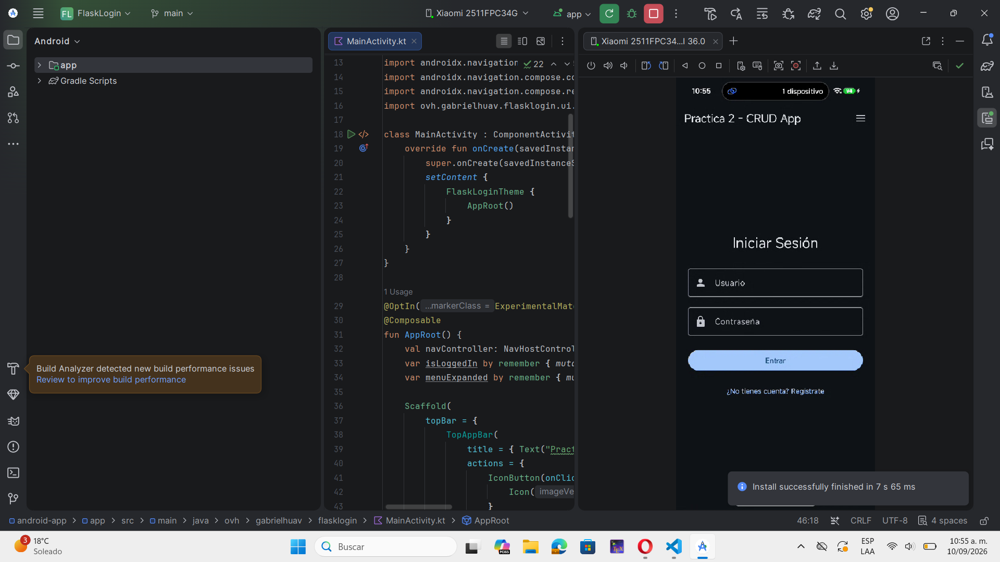
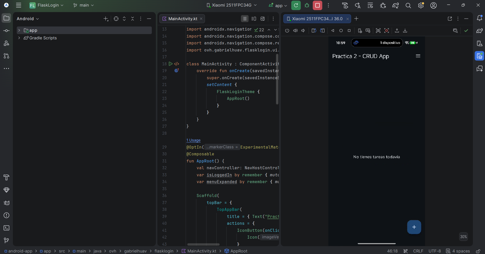
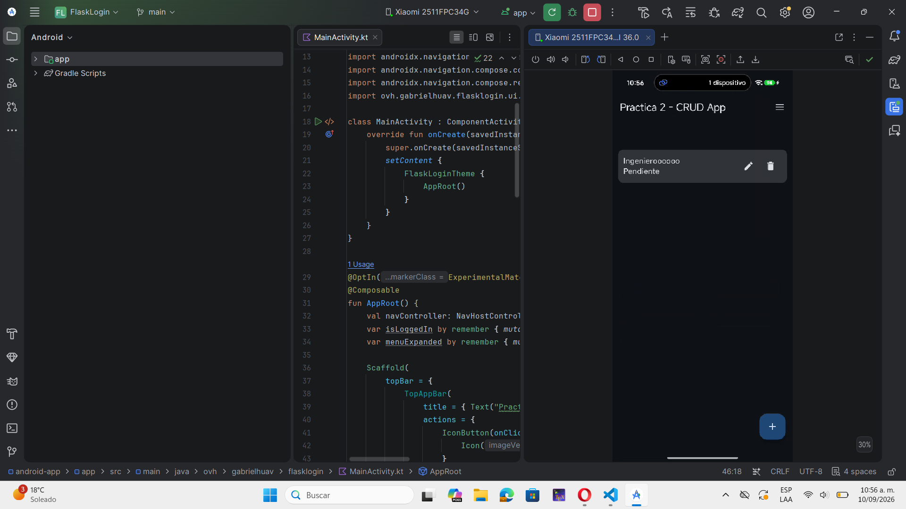
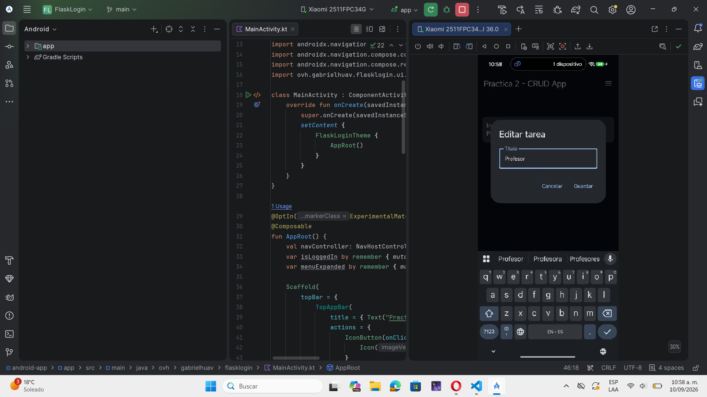
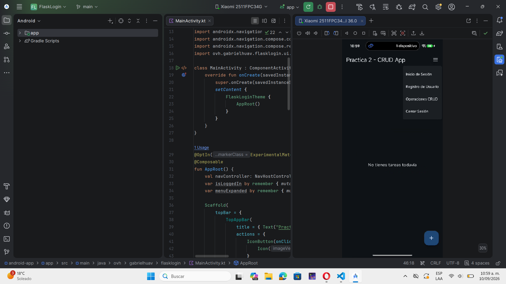
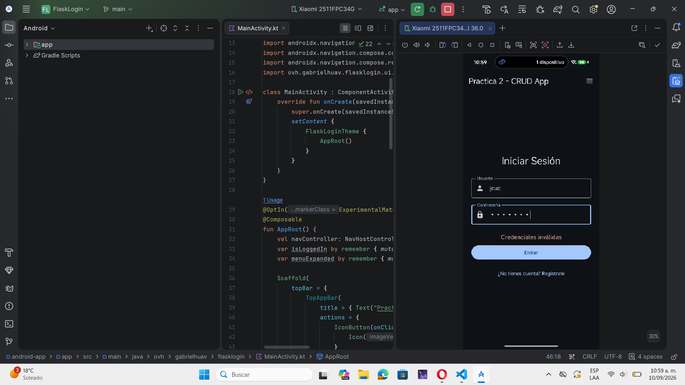

# Práctica 2 — Aplicación móvil básica para operaciones CRUD con un servicio REST

## Portada

- **Nombre completo:** Caballero Pérez Julio César
- **Número de boleta:** 2023630158
- **Grupo:** 7CV4
- **Asignatura:** Desarrollo de aplicaciones móviles nativas
- **Profesor:** Gabriel Hurtado Avilés
- **Fecha de entrega:** 10/Septiembre/2026

---

## Introducción

Este proyecto implementa una aplicación móvil en **Kotlin con Jetpack Compose **, conectada a un backend **REST en Flask**, dockerizado, que expone un sistema de autenticación (registro e inicio de sesión) y operaciones CRUD completas sobre un recurso llamado **Task** (tarea).

Se partió del repositorio de ejemplo proporcionado en la práctica: [Flask-Compose-Login-API](https://github.com/gabrielhuav/Flask-Compose-Login-API), el cual entregaba únicamente la verificación de la API, el registro y el login básicos en el backend, y un proyecto Android base sin lógica de conexión real. Sobre esa base se implementó todo lo que la práctica exige: el CRUD completo, las sesiones seguras con JWT, y la conexión real entre la app y la API.

### Stack elegido y justificación

- **Backend:** Flask + Flask-SQLAlchemy + Flask-Bcrypt + Flask-JWT-Extended, sobre SQLite. Se eligió Flask porque el repositorio de ejemplo ya lo usaba como base, lo cual permitió enfocar el esfuerzo en completar la lógica faltante (CRUD, JWT) en lugar de reescribir la base del servidor desde cero. Flask además es minimalista y facilita documentar claramente cada ruta.
- **Base de datos:** SQLite, por ser un archivo local que no requiere un servidor de base de datos externo, ideal para un entorno de desarrollo y para que el proyecto sea reproducible sin dependencias adicionales.
- **App móvil:** Kotlin + Jetpack Compose, siguiendo la base entregada en el ejemplo. Se usó **Retrofit + OkHttp** como cliente HTTP por ser el estándar de la industria para consumir APIs REST en Android, con soporte nativo para corrutinas.
- **Autenticación:** JSON Web Tokens (JWT) con expiración, en lugar de sesiones basadas en cookies, porque es el mecanismo más común y recomendado para APIs REST consumidas por clientes móviles (no depende de cookies del navegador).

### Archivos modificados o agregados sobre el repositorio de ejemplo

**Backend (`backend/`):**
- `app.py` — se agregó el modelo `Task`, la configuración de JWT (`flask-jwt-extended`), y las 4 rutas CRUD protegidas (`/tasks` con POST, GET, PUT, DELETE). El registro y login originales se conservaron, y se modificó el login para que devuelva un `access_token`.
- `requirements.txt` — se agregó la dependencia `flask-jwt-extended`.
- `docker-compose.yml` — se agregó `env_file: - .env` para cargar la clave secreta de JWT desde una variable de entorno.
- `.env` / `.env.example` — archivos nuevos, no existían en el ejemplo. Contienen la variable `JWT_SECRET_KEY` (el `.env` real no se sube al repositorio).
- `.gitignore` — se agregaron las exclusiones `instance/`, `*.db`, `.env`, `__pycache__/`.

**Aplicación móvil (`android-app/`):**
- `MainActivity.kt` — reescrito por completo: se agregó el `NavHost` con las 3 rutas de navegación, el menú desplegable (`DropdownMenu`) con las opciones de Inicio de Sesión, Registro y Operaciones CRUD, el manejo del estado de sesión (`isLoggedIn`), y el botón de Cerrar Sesión.
- `LoginScreen.kt`, `RegisterScreen.kt` — el ejemplo entregaba estas pantallas con la lógica de conexión intencionalmente incompleta; se implementó la llamada real a la API vía Retrofit, el manejo de los 3 estados de interfaz (carga, error, éxito), y la navegación resultante.
- `CrudScreen.kt` — archivo nuevo, no existía en el ejemplo. Implementa la lista de tareas, y las operaciones de crear, editar y borrar, todas conectadas al backend.
- `ApiService.kt`, `RetrofitClient.kt`, `SessionManager.kt`, `Models.kt`, `UiState.kt`, `Screen.kt` — archivos nuevos, no existían en el ejemplo. Definen la interfaz de red, el cliente Retrofit, el manejo del token en memoria, los modelos de datos, los estados de UI y las rutas de navegación, respectivamente.
- `AndroidManifest.xml` — se agregó el permiso `INTERNET` y el atributo `usesCleartextTraffic="true"`.
- `app/build.gradle.kts` — se agregaron las dependencias de Navigation Compose y Retrofit/OkHttp.

---

## Desarrollo

### Ejercicio 1 — Configuración inicial y diseño de la aplicación

**Menú de navegación.** La aplicación utiliza un `DropdownMenu` de Jetpack Compose, accesible desde un ícono en la barra superior (`TopAppBar`). Este menú se controla mediante un `NavHost` con tres rutas definidas en `Screen.kt`: `login`, `register` y `crud`. Las tres opciones que exige la práctica están presentes:

- **Inicio de Sesión** — siempre visible, navega a la pantalla de login.
- **Registro de Usuario** — siempre visible, navega a la pantalla de registro.
- **Operaciones CRUD** — solo aparece en el menú si el usuario ya inició sesión (`isLoggedIn == true`); si no ha iniciado sesión, esta opción no se muestra en absoluto, evitando que el usuario intente acceder a un recurso protegido antes de autenticarse. Además, la propia pantalla CRUD vuelve a validar `isLoggedIn` como segunda capa de protección.

Cuando el usuario inicia sesión, además aparece una nueva opción de **Cerrar Sesión**, que limpia el token guardado (`SessionManager.clear()`), regresa `isLoggedIn` a `false`, y navega de vuelta al login limpiando el historial de navegación (`popUpTo(0)`) para que el botón "atrás" del dispositivo no permita regresar a la pantalla CRUD sin sesión activa.

**Interfaz de usuario.** Todas las pantallas usan componentes nativos (`Scaffold`, `TopAppBar`, `OutlinedTextField`, `Button`, `CircularProgressIndicator`, `AlertDialog`, `LazyColumn`, `Card`), lo que da consistencia visual y accesibilidad estándar de Android sin necesidad de librerías externas de diseño.

**Manejo de estados.** Se definió una clase `UiState` (sealed class) con 4 estados posibles: `Idle`, `Loading`, `Error(mensaje)` y `Success`. Cada pantalla (Login, Registro, CRUD) mantiene su propio estado local y lo refleja visualmente:
- **Carga:** se muestra un `CircularProgressIndicator` mientras la petición de red está en curso.
- **Error:** se muestra un texto en color de error (por ejemplo, "Credenciales inválidas" o "Completa todos los campos") sin interrumpir el flujo de la app.
- **Sesión iniciada:** al iniciar sesión correctamente, la app navega automáticamente a la pantalla CRUD y el menú se actualiza para reflejar el nuevo estado (aparecen "Operaciones CRUD" y "Cerrar Sesión").

---

### Ejercicio 2 — Backend REST dockerizado

#### Conceptos

- **Docker:** es una herramienta que permite empaquetar una aplicación junto con todo lo necesario para ejecutarla (el lenguaje, las librerías, la configuración) dentro de una unidad aislada llamada contenedor. A diferencia de una máquina virtual, un contenedor comparte el mismo núcleo del sistema operativo del equipo donde corre, por lo que se inicia mucho más rápido. Su principal beneficio es que el mismo proyecto se comporta igual sin importar en qué computadora se ejecute, eliminando el clásico problema de "en mi máquina sí funciona".

- **Imagen y contenedor:** una imagen es como una plantilla congelada que contiene todo lo necesario para correr la aplicación (el sistema base, las dependencias, el código). Un contenedor es una instancia en ejecución de esa imagen. Los contenedores son efímeros: si se eliminan, se pierde cualquier dato que no se haya guardado fuera de ellos, por eso se usan volúmenes para conservar información persistente, como los archivos de código en este proyecto.

- **Dockerfile:** es un archivo de texto plano con instrucciones que Docker sigue, en orden, para construir la imagen del backend. En este proyecto, el `Dockerfile` parte de una imagen ligera de Python (`FROM python:3.9-slim`), define la carpeta de trabajo dentro del contenedor (`WORKDIR /app`), copia el archivo de dependencias e instala las librerías (`COPY requirements.txt` + `RUN pip install`), copia el resto del código (`COPY . .`), declara que el contenedor escuchará en el puerto 5000 (`EXPOSE 5000`), y finalmente indica el comando que arranca la aplicación (`CMD ["python", "app.py"]`).

- **docker-compose.yml:** es un archivo en formato YAML que describe cómo se debe levantar la aplicación como un conjunto de uno o más servicios, especificando sus puertos, volúmenes y variables de entorno. Gracias a este archivo, todo el entorno se levanta o se detiene con un solo comando (`docker compose up --build` / `docker compose down`), sin necesidad de recordar comandos largos de `docker run`.

- **Backend o servicio REST:** es el programa que corre del lado del servidor y expone la lógica del negocio a través de rutas accesibles por HTTP. Recibe peticiones usando los verbos GET, POST, PUT y DELETE, valida y procesa la información recibida, interactúa con la base de datos, y responde en formato JSON junto con un código de estado HTTP que indica el resultado de la operación.

- **ORM y base de datos:** un ORM (Object-Relational Mapper), como SQLAlchemy en este proyecto, permite trabajar con las tablas de la base de datos como si fueran objetos del lenguaje de programación, evitando escribir sentencias SQL manualmente. Se utilizó SQLite como motor de base de datos, que almacena toda la información en un único archivo local (`site.db`), ideal para un entorno de desarrollo por no requerir instalación ni configuración de un servidor de base de datos aparte.

#### Documentación de endpoints

| Método | Ruta | Auth requerida | Parámetros (body) | Ejemplo de petición | Ejemplo de respuesta |
|--------|------|-----------------|---------------------|------------------------|--------------------------|
| GET | `/` | No | — | `curl http://localhost:5000/` | `{"message": "API Funcionando"}` — 200 |
| POST | `/register` | No | `username`, `password` | `{"username": "ana", "password": "1234"}` | `{"message": "Usuario creado exitosamente"}` — 201 |
| POST | `/login` | No | `username`, `password` | `{"username": "ana", "password": "1234"}` | `{"status": "success", "access_token": "eyJ...", "user_id": 1, "username": "ana"}` — 200 |
| POST | `/tasks` | Sí (Bearer token) | `title` | `{"title": "Comprar materiales"}` | `{"id": 1, "title": "Comprar materiales", "done": false}` — 201 |
| GET | `/tasks` | Sí (Bearer token) | — | — | `[{"id": 1, "title": "Comprar materiales", "done": false}]` — 200 |
| PUT | `/tasks/{id}` | Sí (Bearer token) | `title`, `done` (opcionales) | `{"done": true}` | `{"id": 1, "title": "Comprar materiales", "done": true}` — 200 |
| DELETE | `/tasks/{id}` | Sí (Bearer token) | — | — | Sin contenido — 204 |

**Códigos de error usados:**
- `400` — cuando faltan campos obligatorios en el body, o el usuario ya existe en el registro.
- `401` — cuando no se proporciona un token válido en el header `Authorization` para una ruta protegida (manejado automáticamente por `flask-jwt-extended`), o cuando el login falla.
- `404` — cuando se intenta actualizar o borrar una tarea que no existe o no pertenece al usuario autenticado.

#### Instalación y ejecución

```bash
# 1. Clonar el repositorio
git clone https://github.com/TU-USUARIO/Practica2.git
cd Practica2/backend

# 2. Crear el archivo .env a partir de .env.example
#    y definir una clave secreta propia:
#    JWT_SECRET_KEY=tu-clave-secreta  --- de preferencia larga

# 3. Levantar el servicio
docker compose up --build
```

El servicio queda disponible en `http://localhost:5000`. Se verificó su funcionamiento con `Invoke-RestMethod` (PowerShell) antes de conectar la aplicación móvil, probando el registro, el login, y las 4 operaciones sobre `/tasks`, confirmando además que las rutas protegidas responden `401` cuando no se envía un token válido.

#### Autenticación y sesiones seguras

- Las contraseñas se hashean con **Flask-Bcrypt** antes de guardarse; en ningún momento se almacenan en texto plano.
- El login genera un **JSON Web Token (JWT)** firmado con una clave secreta (`JWT_SECRET_KEY`), con un tiempo de expiración por defecto de 15 minutos.
- Todas las rutas del recurso `Task` están protegidas con el decorador `@jwt_required()`, que exige un header `Authorization: Bearer <token>` válido; si no se proporciona, la API responde automáticamente con `401`.
- Cada tarea se asocia al `user_id` extraído del token (`get_jwt_identity()`), de forma que un usuario solo puede ver, editar o borrar sus propias tareas, nunca las de otro usuario.
- La clave secreta de JWT se define en un archivo `.env`, que **no se sube al repositorio** (está excluido en `.gitignore`); en su lugar se publica `.env.example` con el nombre de la variable, sin su valor real.

#### Decisiones técnicas

Durante las pruebas con un dispositivo físico, la red WiFi de la escuela presentó **aislamiento de clientes (client isolation)**, una medida de seguridad de red que impide que dispositivos conectados a la misma red WiFi se comuniquen entre sí directamente. Esto provocó que el celular no pudiera alcanzar el backend corriendo en la laptop, aunque ambos estuvieran en la misma red y el backend funcionara correctamente (verificado desde el navegador de la propia laptop). Como solución, se activó un **hotspot personal desde el celular** y se conectó la laptop a esa red; de esta forma ambos dispositivos comparten una red controlada por el propio equipo de trabajo, sin restricciones de aislamiento, permitiendo que la app se conecte al backend usando la IP local asignada por el hotspot.

---

### Ejercicio 3 — Implementación del sistema de autenticación en la aplicación móvil

**Pantallas de Login y Registro.** Se implementaron ambas pantallas con Jetpack Compose, cada una con sus propios campos (`OutlinedTextField`) para usuario y contraseña (y confirmación de contraseña en el caso del registro), validación básica de campos vacíos y de coincidencia de contraseñas, y manejo visual de los 3 estados de UI (carga, error, éxito).

**Conexión a la API REST.** Se utilizó **Retrofit** junto con **OkHttp** como cliente HTTP. Se definió una interfaz `ApiService` con los métodos correspondientes a cada endpoint del backend (`register`, `login`, `getTasks`, `createTask`, `updateTask`, `deleteTask`), todos ellos funciones `suspend` para ejecutarse dentro de corrutinas de Kotlin sin bloquear el hilo principal de la interfaz.

**Permisos y tráfico en texto claro.** En `AndroidManifest.xml` se declaró el permiso `<uses-permission android:name="android.permission.INTERNET" />`, y se habilitó `android:usesCleartextTraffic="true"` en la etiqueta `<application>`, ya que durante el desarrollo la API se consume por HTTP sin TLS.

**Configuración de la URL base.** Se documenta a continuación cómo se configuró la dirección del backend según el escenario de prueba:

- **Desde el emulador de Android:** la dirección `localhost` apunta al propio emulador, no a la computadora anfitriona. Por ello se usó `http://10.0.2.2:5000/`, una dirección especial que el emulador traduce automáticamente hacia el `localhost` de la máquina donde corre.
- **Desde un dispositivo físico:** se utilizó la dirección IP local de la laptop dentro de la red compartida (en este caso, mediante el hotspot descrito en la sección de decisiones técnicas del Ejercicio 2), por ejemplo `http://192.168.43.XX:5000/`. Esta URL se configura en el archivo `RetrofitClient.kt`, en la constante `BASE_URL`.

**Pruebas realizadas en dispositivo real**, con capturas de pantalla incluidas más abajo:

1. Registro de un usuario nuevo.
2. Inicio de sesión con ese usuario.
3. Creación de una tarea (POST).
4. Visualización de la lista de tareas (GET).
5. Edición de una tarea existente (PUT).
6. Eliminación de una tarea (DELETE).
7. Intento de inicio de sesión con credenciales incorrectas, confirmando el manejo correcto del error sin cerrar la aplicación.

#### Capturas de pantalla

**1. Registro de usuario**


**2. Inicio de sesión**


**3. Crear tarea (POST)**


**4. Leer tareas (GET)**


**5. Actualizar tarea (PUT)**


**6. Borrar tarea (DELETE)**


**7. Manejo de credenciales incorrectas**


---

## Conclusiones

El desarrollo de esta práctica permitió comprender de forma práctica cómo se conectan tres capas independientes de una aplicación real: la base de datos, el backend REST dockerizado, y el cliente móvil. Entre los principales retos enfrentados estuvieron:

- **Configuración del entorno de desarrollo:** la creación correcta de archivos especiales como `.env` en Windows, y la sincronización inicial de Gradle en Android Studio, tomaron más tiempo del esperado por particularidades del sistema operativo y del entorno.
- **Conectividad entre dispositivos:** el error de conexión al usar un dispositivo físico reveló un concepto importante de redes, el aislamiento de clientes en redes WiFi públicas, que no es evidente hasta que se experimenta directamente. Resolverlo mediante un hotspot personal permitió entender la diferencia entre `10.0.2.2` (uso exclusivo del emulador) y una IP local real.
- **Seguridad de la autenticación:** implementar JWT en lugar de simplemente comparar usuario/contraseña en cada petición ayudó a comprender por qué las sesiones firmadas con expiración son más seguras que enviar credenciales repetidamente.

Como logro principal, se consiguió una aplicación funcional de extremo a extremo: desde el registro y login con contraseñas hasheadas, hasta las cuatro operaciones CRUD protegidas por token, todo verificado tanto por línea de comandos como desde la interfaz gráfica real en un dispositivo físico.

---

## Bibliografía

Flask. (s.f.). *Flask Documentation*. Pallets Projects. https://flask.palletsprojects.com/

Flask-JWT-Extended. (s.f.). *Flask-JWT-Extended Documentation*. https://flask-jwt-extended.readthedocs.io/

Introducing JSON Web Tokens. (s.f.). *JWT.io*. https://jwt.io/introduction

Android Developers. (s.f.). *Jetpack Compose*. Google. https://developer.android.com/jetpack/compose

Square. (s.f.). *Retrofit — A type-safe HTTP client for Android and Java*. https://square.github.io/retrofit/

Docker Inc. (s.f.). *Docker Documentation*. https://docs.docker.com/

SQLAlchemy. (s.f.). *SQLAlchemy Documentation*. https://www.sqlalchemy.org/
